# VOCOS

## Архитектура модели

Vocos состоит из двух компонент:

1) Backbone - извлекает признаки из спектрограммы на входе:

    - Conv1d
    - LayerNorm
    - ConvNeXt (8 блоков)
    - LayerNorm

Conv1d и Linear инициализируется из усеченного нормального распределения.

2) ISTFTHead - преобразует вектор из латентного пространства признаков в параметры амплитуды и фазы, затем генерирует спектрограмму и преобразует её обратно в аудио c помощью обратного преобразования Фурье.

    - Linear
    - Разделение выхода на два канала: $mag$, $p$
    - Получение спектрограммы через комплексный спектр: $S=exp(mag) \cdot (cos(p)+j \cdot sin(p))$
    - ISTFT

## Loss

|Loss|Комментарий|Коэф.|
|-|-|-|
|$l_{mel}$|L1 расстояние между входной спектрограммой и спектрограммой аудио на выходе модели.|45|
|$l_{G}$|Hinge loss (Для генератора) $\frac{1}{K}\sum_kmax(0,1-D_k(\hat{x}))$, где K - кол-во дискриминаторов, $D_k$ - k-ый дискриминатор, $\hat{x}$ - сгенерированное аудио|1|
|$L_{D}$|Hinge loss (Для дискриминатора) $\frac{1}{K}\sum_kmax(0,1-D_k(x))+max(0,1+D_k(\hat{x}))$, где $x$ - оригинальное аудио|-|
|$l_{feat}$|L1 между промежуточными feature maps дискриминаторов|2|

Лосс генератора:

$$L_G=45 \cdot l_{mel} + l_{G} + 2 \cdot l_{feat}$$

## Mel-спектрограмма

В отличие от оригинальной статьи в этой имплементации используется кастомная mel-спектрограмма (src/transforms/melspectrogram.py).

## GAN-Обучение

- Используется комбинация из двух дискриминаторов MPD (Multi-Period Discriminator) и MRD (Multi-Resolution Discriminator), обучающихся параллельно друг с другом.
- Чередование шагов D и G за каждый батч.
- На шаге D градиенты для генератора заморожены, на шаге G - для дискриминатора.
- $l_{feat}$ стабилизирует обучение - генератор учится воспроизводить внутренние представления дискриминатора, а не только обманывать его выход.

---

## Эксперименты

Параметры трейнера и модели в большинстве своём совпадают с параметрами из статьи. Из отличий: был отключён `lr_scheduler` (в конфиге он присутствует лишь в качестве заглушки), а также уменьшен размер батча из-за ограниченности вычислительных ресурсов. Кроме того, использованные аудиозаписи имели частоту дискретизации 22050 Гц.

В ходе one-batch теста с параметрами по умолчанию было замечено, что лосс убывает крайне медленно, тогда как качество модели постепенно растёт. На основании этого было выдвинуто предположение о недостаточно высоком значении learning rate. Для его проверки было проведено 3 эксперимента на фиксированном батче в течение 500 эпох с неизменными остальными параметрами, но разными значениями learning rate: 2e-4 (значение по умолчанию), 3e-4, 4e-4.

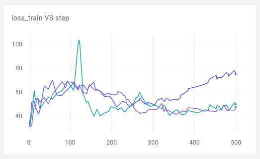

На графике фиолетовая кривая соответствует lr=2e-4, лазурная — lr=3e-4, синяя — lr=4e-4. Наиболее стабильную динамику демонстрирует кривая, соответствующая значению по умолчанию, поэтому для полного обучения learning rate оставлен без изменений.

## Как воспроизвести модель

Инструкции по воспроизведению обучения и запуску инференса приведены в README.md.

## Логи обучения и экспериментов

https://www.comet.com/vasilyryabtsev/vocos-project/view/new/panels

## Возникшие сложности при обучении

В процессе обучения был достигнут лимит доступных ресурсов GPU, что вынудило досрочно остановить эксперимент. При этом, судя по кривым потерь, модель ещё не вышла на плато, и дальнейшее обучение могло бы улучшить качество.

---

## Тестирование

### Анализ на обучающих данных

<table>
  <thead>
    <tr>
      <th>#</th>
      <th>Cпектрограмма (оригинал)</th>
      <th>Аудио (оригинал)</th>
      <th>Cпектрограмма (сгенерированная)</th>
      <th>Аудио (сгенерированное)</th>
    </tr>
  </thead>
  <tbody>
    <tr>
      <td>0</td>
      <td>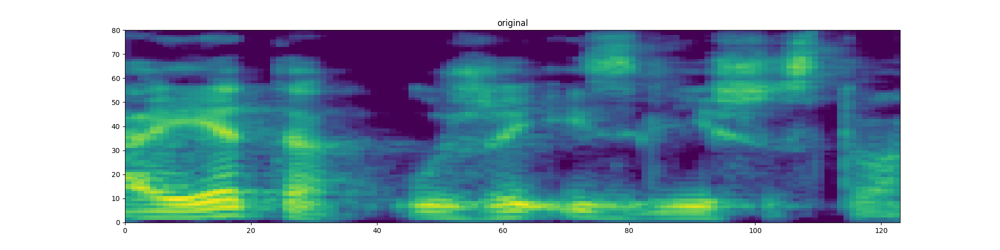</td>
      <td><audio controls src="test/ruslan_inference/inference/audio/orig_0_0.wav"></audio> <a href="test/ruslan_inference/inference/audio/orig_0_0.wav">play</a></td>
      <td>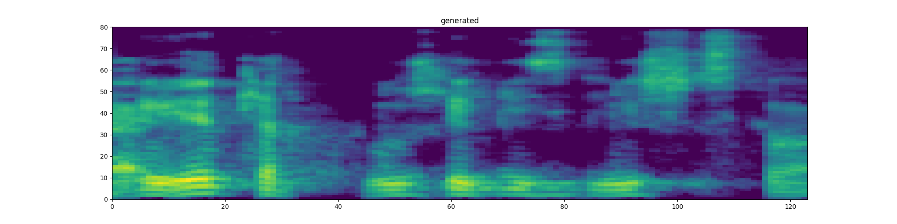</td>
      <td><audio controls src="test/ruslan_inference/inference/audio/gen_0_0.wav"></audio> <a href="test/ruslan_inference/inference/audio/gen_0_0.wav">play</a></td>
    </tr>
    <tr>
      <td>1</td>
      <td>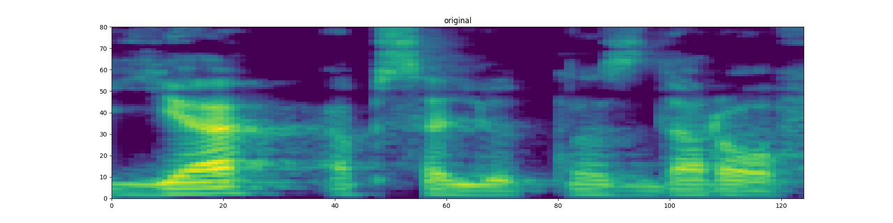</td>
      <td><audio controls src="test/ruslan_inference/inference/audio/orig_1_0.wav"></audio> <a href="test/ruslan_inference/inference/audio/orig_1_0.wav">play</a></td>
      <td>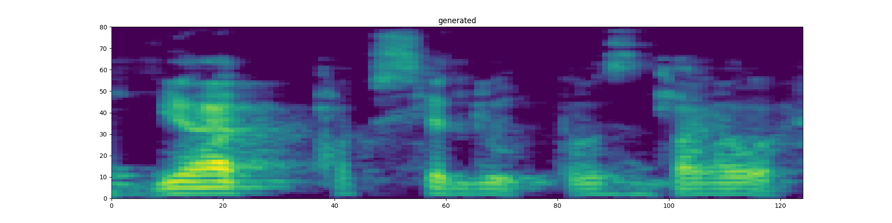</td>
      <td><audio controls src="test/ruslan_inference/inference/audio/gen_1_0.wav"></audio> <a href="test/ruslan_inference/inference/audio/gen_1_0.wav">play</a></td>
    </tr>
    <tr>
      <td>2</td>
      <td>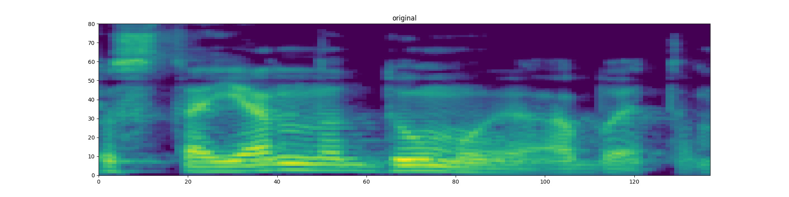</td>
      <td><audio controls src="test/ruslan_inference/inference/audio/orig_2_0.wav"></audio> <a href="test/ruslan_inference/inference/audio/orig_2_0.wav">play</a></td>
      <td>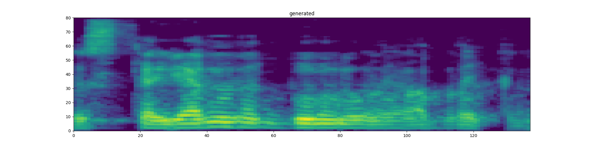</td>
      <td><audio controls src="test/ruslan_inference/inference/audio/gen_2_0.wav"></audio> <a href="test/ruslan_inference/inference/audio/gen_2_0.wav">play</a></td>
    </tr>
    <tr>
      <td>3</td>
      <td>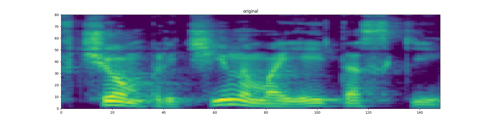</td>
      <td><audio controls src="test/ruslan_inference/inference/audio/orig_3_0.wav"></audio> <a href="test/ruslan_inference/inference/audio/orig_3_0.wav">play</a></td>
      <td>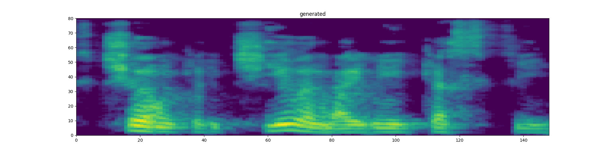</td>
      <td><audio controls src="test/ruslan_inference/inference/audio/gen_3_0.wav"></audio> <a href="test/ruslan_inference/inference/audio/gen_3_0.wav">play</a></td>
    </tr>
    <tr>
      <td>4</td>
      <td>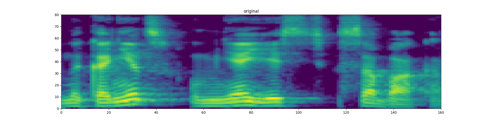</td>
      <td><audio controls src="test/ruslan_inference/inference/audio/orig_4_0.wav"></audio> <a href="test/ruslan_inference/inference/audio/orig_4_0.wav">play</a></td>
      <td>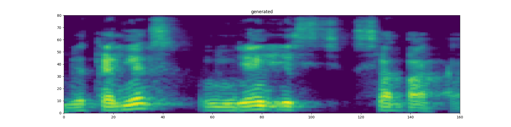</td>
      <td><audio controls src="test/ruslan_inference/inference/audio/gen_4_0.wav"></audio> <a href="test/ruslan_inference/inference/audio/gen_4_0.wav">play</a></td>
    </tr>
    <tr>
      <td>5</td>
      <td>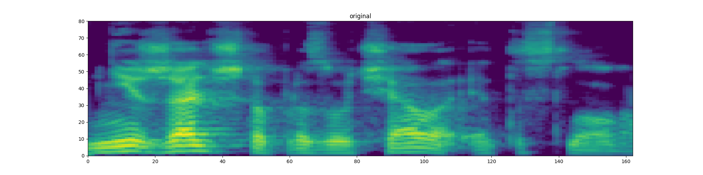</td>
      <td><audio controls src="test/ruslan_inference/inference/audio/orig_5_0.wav"></audio> <a href="test/ruslan_inference/inference/audio/orig_5_0.wav">play</a></td>
      <td>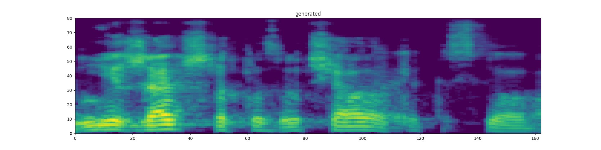</td>
      <td><audio controls src="test/ruslan_inference/inference/audio/gen_5_0.wav"></audio> <a href="test/ruslan_inference/inference/audio/gen_5_0.wav">play</a></td>
    </tr>
    <tr>
      <td>6</td>
      <td>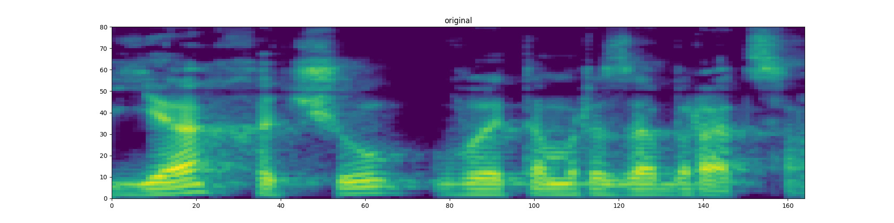</td>
      <td><audio controls src="test/ruslan_inference/inference/audio/orig_6_0.wav"></audio> <a href="test/ruslan_inference/inference/audio/orig_6_0.wav">play</a></td>
      <td>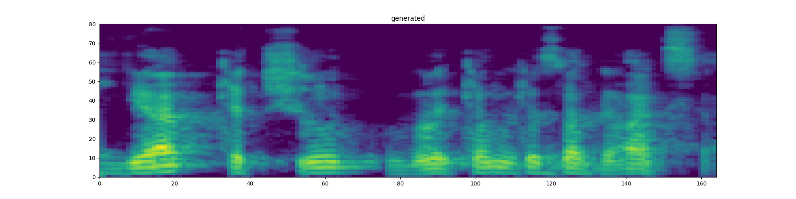</td>
      <td><audio controls src="test/ruslan_inference/inference/audio/gen_6_0.wav"></audio> <a href="test/ruslan_inference/inference/audio/gen_6_0.wav">play</a></td>
    </tr>
    <tr>
      <td>7</td>
      <td>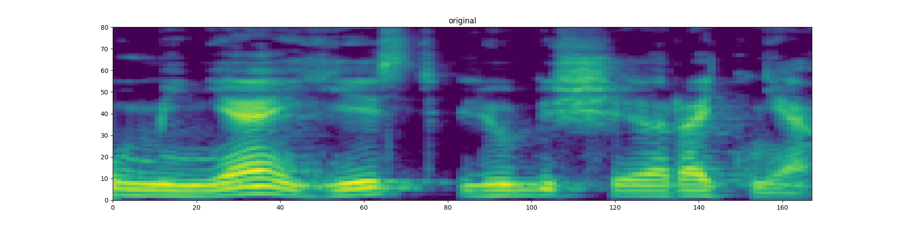</td>
      <td><audio controls src="test/ruslan_inference/inference/audio/orig_7_0.wav"></audio> <a href="test/ruslan_inference/inference/audio/orig_7_0.wav">play</a></td>
      <td>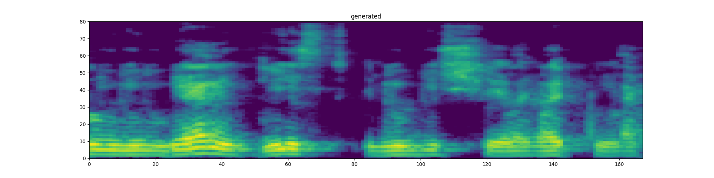</td>
      <td><audio controls src="test/ruslan_inference/inference/audio/gen_7_0.wav"></audio> <a href="test/ruslan_inference/inference/audio/gen_7_0.wav">play</a></td>
    </tr>
    <tr>
      <td>8</td>
      <td>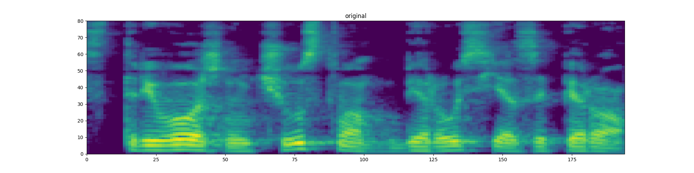</td>
      <td><audio controls src="test/ruslan_inference/inference/audio/orig_8_0.wav"></audio> <a href="test/ruslan_inference/inference/audio/orig_8_0.wav">play</a></td>
      <td>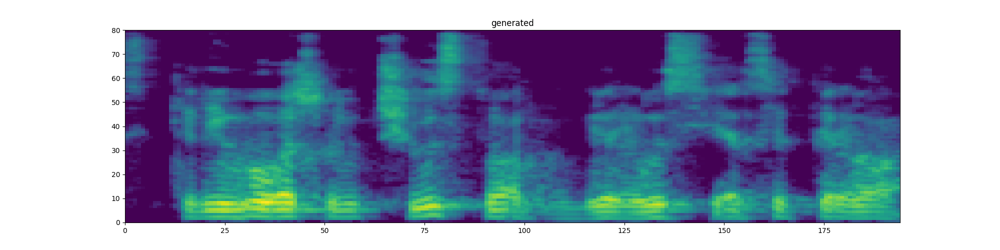</td>
      <td><audio controls src="test/ruslan_inference/inference/audio/gen_8_0.wav"></audio> <a href="test/ruslan_inference/inference/audio/gen_8_0.wav">play</a></td>
    </tr>
    <tr>
      <td>9</td>
      <td>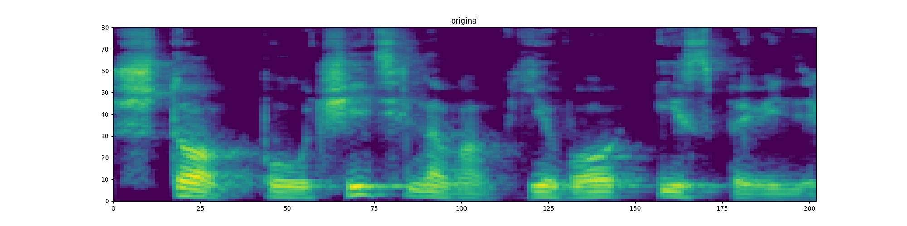</td>
      <td><audio controls src="test/ruslan_inference/inference/audio/orig_9_0.wav"></audio> <a href="test/ruslan_inference/inference/audio/orig_9_0.wav">play</a></td>
      <td>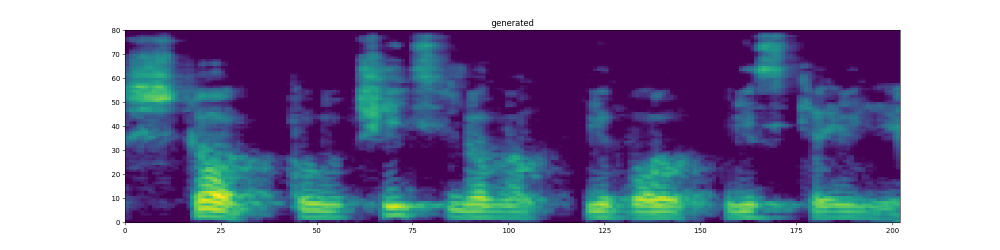</td>
      <td><audio controls src="test/ruslan_inference/inference/audio/gen_9_0.wav"></audio> <a href="test/ruslan_inference/inference/audio/gen_9_0.wav">play</a></td>
    </tr>
    <tr>
      <td>10</td>
      <td>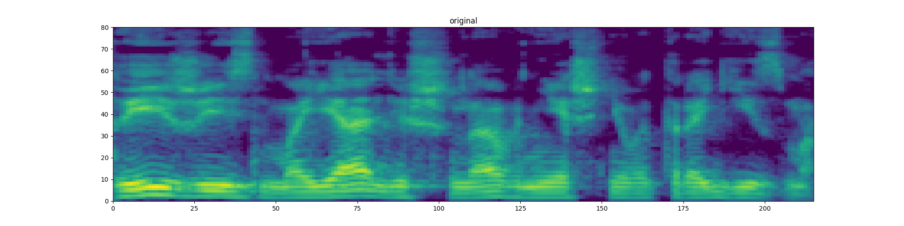</td>
      <td><audio controls src="test/ruslan_inference/inference/audio/orig_10_0.wav"></audio> <a href="test/ruslan_inference/inference/audio/orig_10_0.wav">play</a></td>
      <td>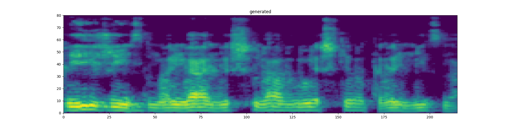</td>
      <td><audio controls src="test/ruslan_inference/inference/audio/gen_10_0.wav"></audio> <a href="test/ruslan_inference/inference/audio/gen_10_0.wav">play</a></td>
    </tr>
    <tr>
      <td>11</td>
      <td>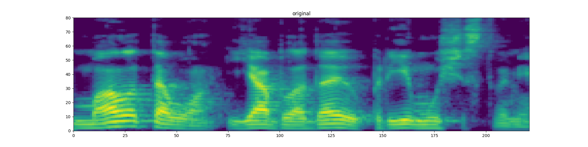</td>
      <td><audio controls src="test/ruslan_inference/inference/audio/orig_11_0.wav"></audio> <a href="test/ruslan_inference/inference/audio/orig_11_0.wav">play</a></td>
      <td>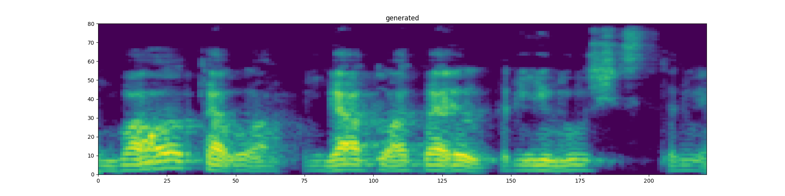</td>
      <td><audio controls src="test/ruslan_inference/inference/audio/gen_11_0.wav"></audio> <a href="test/ruslan_inference/inference/audio/gen_11_0.wav">play</a></td>
    </tr>
    <tr>
      <td>12</td>
      <td>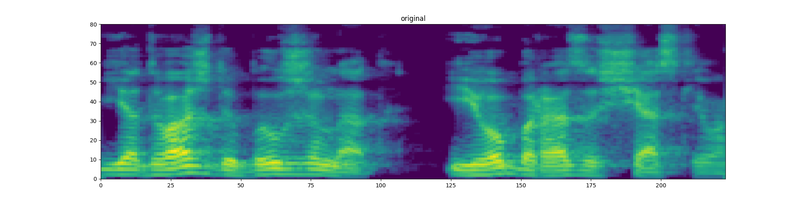</td>
      <td><audio controls src="test/ruslan_inference/inference/audio/orig_12_0.wav"></audio> <a href="test/ruslan_inference/inference/audio/orig_12_0.wav">play</a></td>
      <td>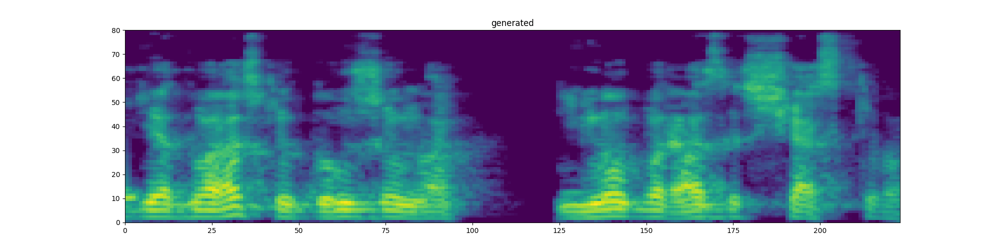</td>
      <td><audio controls src="test/ruslan_inference/inference/audio/gen_12_0.wav"></audio> <a href="test/ruslan_inference/inference/audio/gen_12_0.wav">play</a></td>
    </tr>
    <tr>
      <td>13</td>
      <td>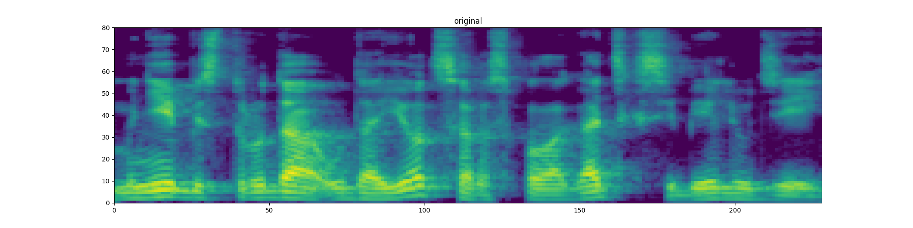</td>
      <td><audio controls src="test/ruslan_inference/inference/audio/orig_13_0.wav"></audio> <a href="test/ruslan_inference/inference/audio/orig_13_0.wav">play</a></td>
      <td>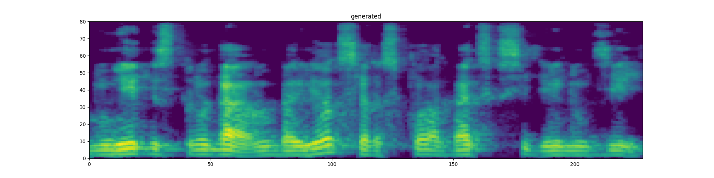</td>
      <td><audio controls src="test/ruslan_inference/inference/audio/gen_13_0.wav"></audio> <a href="test/ruslan_inference/inference/audio/gen_13_0.wav">play</a></td>
    </tr>
    <tr>
      <td>14</td>
      <td>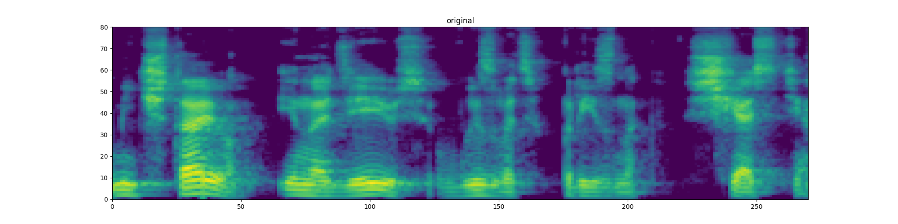</td>
      <td><audio controls src="test/ruslan_inference/inference/audio/orig_14_0.wav"></audio> <a href="test/ruslan_inference/inference/audio/orig_14_0.wav">play</a></td>
      <td>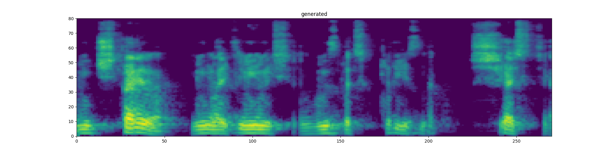</td>
      <td><audio controls src="test/ruslan_inference/inference/audio/gen_14_0.wav"></audio> <a href="test/ruslan_inference/inference/audio/gen_14_0.wav">play</a></td>
    </tr>
    <tr>
      <td>15</td>
      <td>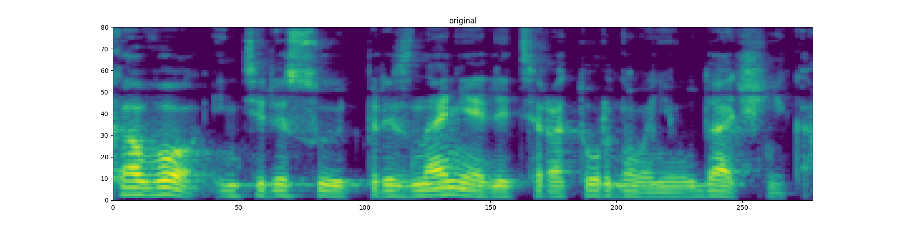</td>
      <td><audio controls src="test/ruslan_inference/inference/audio/orig_15_0.wav"></audio> <a href="test/ruslan_inference/inference/audio/orig_15_0.wav">play</a></td>
      <td>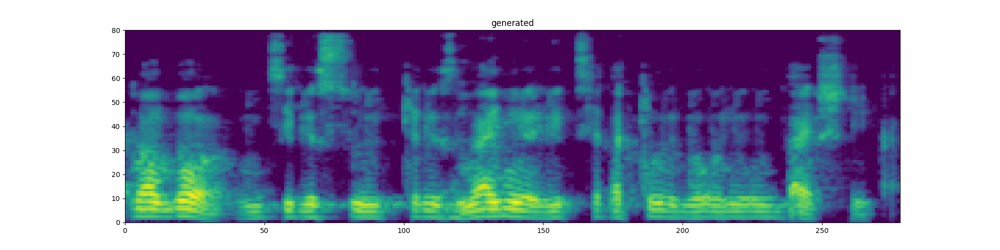</td>
      <td><audio controls src="test/ruslan_inference/inference/audio/gen_15_0.wav"></audio> <a href="test/ruslan_inference/inference/audio/gen_15_0.wav">play</a></td>
    </tr>
    <tr>
      <td>16</td>
      <td>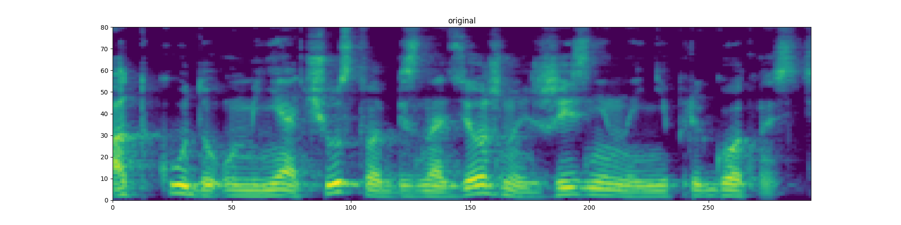</td>
      <td><audio controls src="test/ruslan_inference/inference/audio/orig_16_0.wav"></audio> <a href="test/ruslan_inference/inference/audio/orig_16_0.wav">play</a></td>
      <td>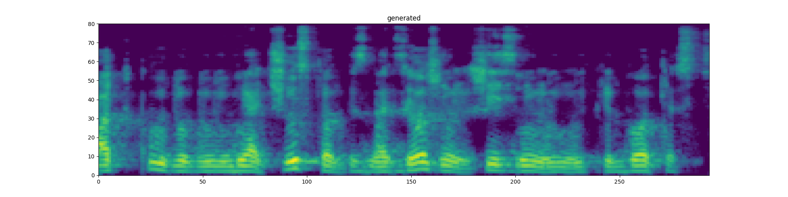</td>
      <td><audio controls src="test/ruslan_inference/inference/audio/gen_16_0.wav"></audio> <a href="test/ruslan_inference/inference/audio/gen_16_0.wav">play</a></td>
    </tr>
    <tr>
      <td>17</td>
      <td>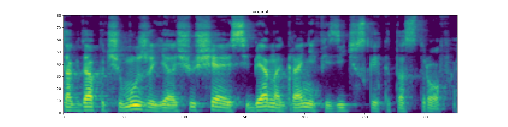</td>
      <td><audio controls src="test/ruslan_inference/inference/audio/orig_17_0.wav"></audio> <a href="test/ruslan_inference/inference/audio/orig_17_0.wav">play</a></td>
      <td>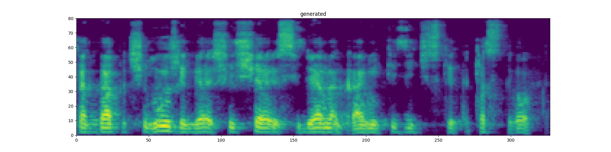</td>
      <td><audio controls src="test/ruslan_inference/inference/audio/gen_17_0.wav"></audio> <a href="test/ruslan_inference/inference/audio/gen_17_0.wav">play</a></td>
    </tr>
    <tr>
      <td>18</td>
      <td>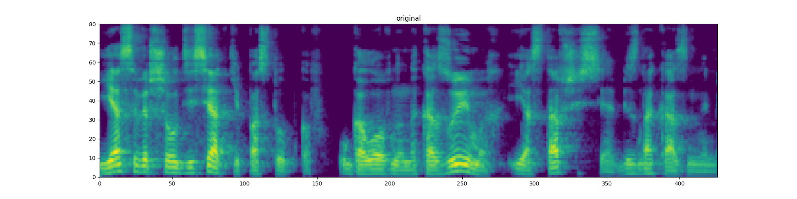</td>
      <td><audio controls src="test/ruslan_inference/inference/audio/orig_18_0.wav"></audio> <a href="test/ruslan_inference/inference/audio/orig_18_0.wav">play</a></td>
      <td>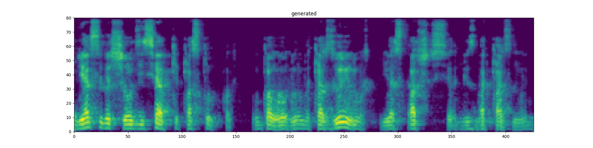</td>
      <td><audio controls src="test/ruslan_inference/inference/audio/gen_18_0.wav"></audio> <a href="test/ruslan_inference/inference/audio/gen_18_0.wav">play</a></td>
    </tr>
    <tr>
      <td>19</td>
      <td>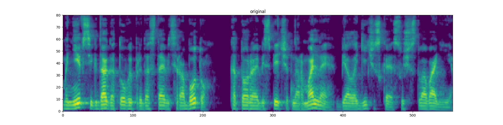</td>
      <td><audio controls src="test/ruslan_inference/inference/audio/orig_19_0.wav"></audio> <a href="test/ruslan_inference/inference/audio/orig_19_0.wav">play</a></td>
      <td>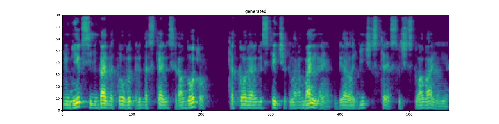</td>
      <td><audio controls src="test/ruslan_inference/inference/audio/gen_19_0.wav"></audio> <a href="test/ruslan_inference/inference/audio/gen_19_0.wav">play</a></td>
    </tr>
  </tbody>
</table>

Глобальные паттерны по частотно-временной шкале у спектрограмм оригинала и сгенерированного аудио похожи, однако при детальном рассмотрении заметно, что сгенерированное аудио упрощает многие локальные паттерны. Структура оригинальной спектрограммы значительно сложнее сгенерированной.

В сгенерированном аудио текст в большинстве случаев различим с первого раза; присутствует лёгкий эффект роботизированного голоса и эффект "дрожания". Оригинальное аудио можно без труда отличить от сгенерированного.

### Анализ на внешних данных

<table>
  <thead>
    <tr>
      <th>#</th>
      <th>Cпектрограмма (оригинал)</th>
      <th>Аудио (оригинал)</th>
      <th>Cпектрограмма (сгенерированная)</th>
      <th>Аудио (сгенерированное)</th>
    </tr>
  </thead>
  <tbody>
    <tr>
      <td>0</td>
      <td>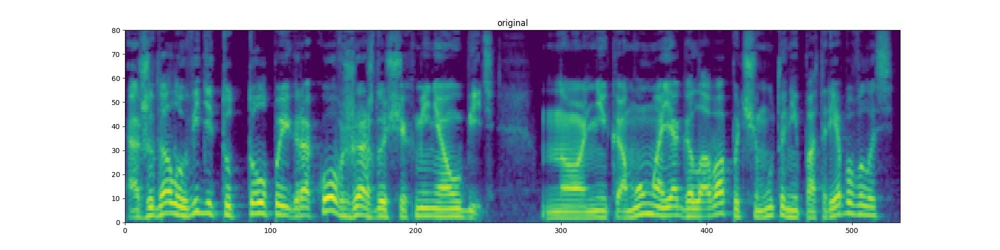</td>
      <td><audio controls src="test/MOS_inference/inference/audio/orig_0_0.wav"></audio> <a href="test/MOS_inference/inference/audio/orig_0_0.wav">play</a></td>
      <td>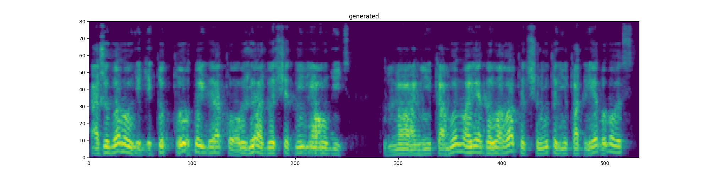</td>
      <td><audio controls src="test/MOS_inference/inference/audio/gen_0_0.wav"></audio> <a href="test/MOS_inference/inference/audio/gen_0_0.wav">play</a></td>
    </tr>
    <tr>
      <td>1</td>
      <td>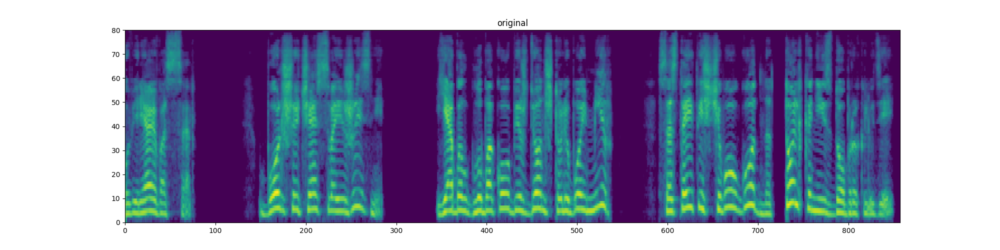</td>
      <td><audio controls src="test/MOS_inference/inference/audio/orig_1_0.wav"></audio> <a href="test/MOS_inference/inference/audio/orig_1_0.wav">play</a></td>
      <td>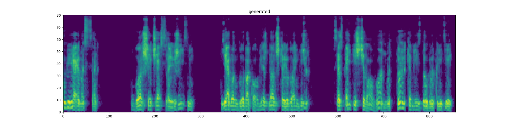</td>
      <td><audio controls src="test/MOS_inference/inference/audio/gen_1_0.wav"></audio> <a href="test/MOS_inference/inference/audio/gen_1_0.wav">play</a></td>
    </tr>
    <tr>
      <td>2</td>
      <td>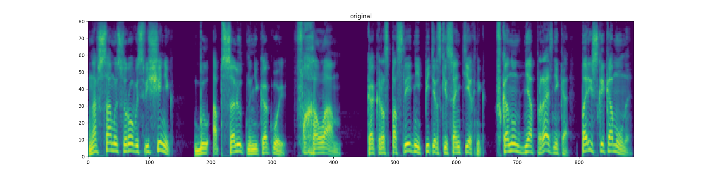</td>
      <td><audio controls src="test/MOS_inference/inference/audio/orig_2_0.wav"></audio> <a href="test/MOS_inference/inference/audio/orig_2_0.wav">play</a></td>
      <td>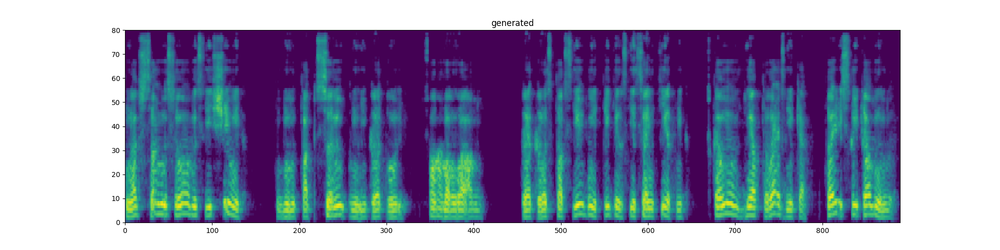</td>
      <td><audio controls src="test/MOS_inference/inference/audio/gen_2_0.wav"></audio> <a href="test/MOS_inference/inference/audio/gen_2_0.wav">play</a></td>
    </tr>
  </tbody>
</table>

На внешних данных, помимо упрощённой локальной структуры частотно-временной шкалы, у сгенерированной спектрограммы возникли проблемы с глобальной структурой: появились более широкие полосы по временной и частотной осям по сравнению с оригинальной спектрограммой.

Голос в аудио стал более роботизированным, слова стало труднее различать (хотя по-прежнему можно без особого труда). Также появилась проблема с тем, что восстановленное аудио не сохраняет фонетические характеристики исходного сигнала (женский голос переходит в мужской). Вероятно, это связано с тем, что модель обучалась на голосе только одного диктора.
